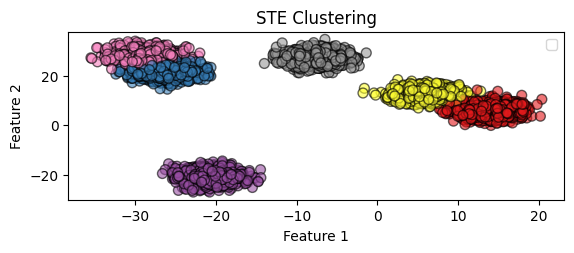

# STE-K-Means

This repository contains the proof of concept for a differentiable K-Means solver using the Straight Through Estimator. The key property of K-Means, which says that it can be interpreted as a matrix factorization problem is leveraged to get a constrained low-rank factorization problem. The Gumbel-Straight-Trhough operator is then used to cast this problem into a differentiable form.


## Implementation
The core principle relies on considering the K-Means as a matrix factorization problem. Specifically the data points $\mathbf{x}_i$ are concatenated in a data matrix $\mathbf{X}$ given as: 
```math
\mathbf{X} = \begin{bmatrix} \mathbf{x}_1^T \\
    \mathbf{x}_2^T \\
    \vdots \\
    \mathbf{x}_n^T \end{bmatrix} 
```
The result from [Baukhage 2015](https://arxiv.org/pdf/1512.07548) is used to formulate the K-Means problem as a low-rank matrix factorization problem of the form:
```math
\min_{\mathbf{U}} \|\mathbf{X} - \mathbf{U}(\mathbf{U}^T\mathbf{U})^{-1}\mathbf{U}^T \|_F^2
```
such that: $\mathbf{U} \in \{0,1\}^{k \times n}$ and:
```math
\sum_i \mathbf{U} = 1.
```
In the STE context this problem can be solved by defining trainable weight matrix $\mathbf{M}$ which is initialized using [K-Means++](https://theory.stanford.edu/~sergei/papers/kMeansPP-soda.pdf) and then partitioned as:
```math
\mathbf{M} = \begin{bmatrix}\mathbf{D} & \mathbf{W} \end{bmatrix}
```
such that $\mathbf{D} = \in \mathbb{R}^{k \times k}$ and $\mathbf{W} \in \mathbb{R}^{n - k \times n}$. During training $\mathbf{U}$ is evaluated as:
```math
\mathbf{U}^T = \begin{bmatrix}\mathbf{D} & \mathbf{g}(\mathbf{W}) \end{bmatrix}
```  
where $\mathbf{g}(\cdot)$ is the **Gumbel-Straight-Through** operator. The objective is then optimized using **Adam**. 

### K-means


### STE K-means

